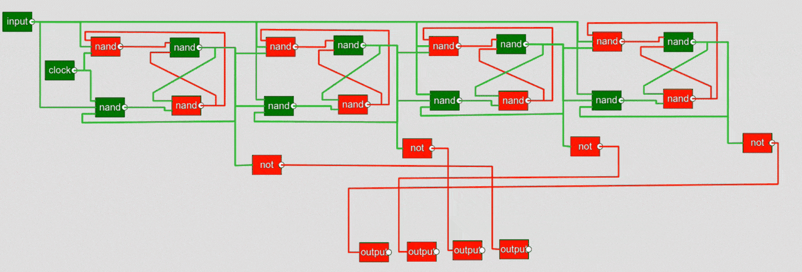

# GateCraft — Digital Logic Simulator

A browser-based digital logic circuit simulator built with [p5.js](https://p5js.org/). Place logic gates, wire them together, toggle inputs, and watch signals propagate in real time — including support for sequential circuits like SR latches and T flip-flops.

---

## Demo



*A 4-bit ripple counter — four T flip-flops chained together, counting from 0 to 15 and wrapping back around.*

---

## Features

- **7 gate types** — AND, OR, NOT, NAND, NOR, XOR, XNOR
- **I/O components** — Input (toggle), Output (display), Clock (auto-oscillator)
- **Composite gates** — Save any circuit as a reusable composite gate with labeled I/O ports; composites can be nested arbitrarily deep
- **Persistence** — Composite gate definitions are stored in localStorage and appear in the sidebar for one-click reuse
- **Wire routing** — Orthogonal wires with draggable waypoints; auto-routes around gates
- **Signal propagation** — Color-coded wires (high / low colors adapt to the active theme)
- **Sequential circuit support** — Iterative settling handles feedback loops that don't resolve in a single pass
- **Grid system** — Dot grid background with snap-to-grid placement and movement for clean, aligned layouts
- **9 color themes** — Graphite, Forge, Terminal, Voltage, Neon, Ocean, Molten, Retro, Blueprint — switchable from the settings panel
- **WebAssembly evaluation** — Core simulation runs in a compiled C → WASM engine with delta-cycle propagation for fast evaluation of large circuits
- **3 editor modes** — Edit, Run, Delete
- **Drag to reposition** — Gates and connected wires move together, snapping to the grid

---

## Getting Started

No build step or package manager needed. Just serve the files over HTTP.

**Using the VS Code Live Server extension:**
```
Right-click index.html → Open with Live Server
```

**Using Python:**
```bash
python -m http.server 8000
# then open http://localhost:8000
```

> Opening `index.html` directly as a `file://` URL won't work because ES modules require an HTTP server.

---

## How to Use

### Building a circuit

1. Click any component in the left sidebar to pick it up, then click on the canvas to place it (placement snaps to the grid)
2. In **Edit** mode, click and drag over a gate's output port (right side) to start drawing a wire
3. Click near the left side of another gate to complete the connection
4. Drag gates to reposition them; wires follow automatically

### Running a circuit

1. Switch to **Run** mode using the toolbar
2. Click an **Input** node to toggle it between `true` and `false`
3. Click a **Clock** node to start it oscillating (1 Hz by default); click again to stop it
4. Watch signals propagate through the circuit in real time

### Creating composite gates

1. Build a circuit using Input and Output nodes as the external interface
2. Click **Save as Gate** in the top toolbar and give it a name
3. The circuit is saved to localStorage and appears under the **Composite** section in the sidebar
4. Click the composite gate button to place instances of it on any future circuit

### Deleting components

Switch to **Delete** mode and click any gate to remove it along with all its connected wires.

### Changing themes

Click the **Settings** (⚙) icon in the top toolbar to open the theme picker. Choose from 9 themes — each one reskins the entire UI including the canvas grid, gates, wires, and sidebar.

---

## Project Structure

```
gatecraft/
├── sketch.js              # Entry point — p5 setup() and draw(), grid rendering
├── state.js               # Shared mutable state (mode, dragging, ghostNode, gridDirty, etc.)
├── constants.js           # GATE_DEFS, GRID_SIZE, GRID_OFFSET, PORT_RADIUS, etc.
├── persistence.js         # Save / load / list / delete composite gates (localStorage)
│
├── logic/
│   ├── gates.js           # Input, Clock, Output, Gate, CompositeGate classes
│   ├── wire.js            # Wire class
│   ├── evaluate.js        # evaluateAll, evaluateOnce, settleCircuit, WASM bridge
│   ├── evaluate.c         # C source for the WASM evaluation engine
│   ├── evaluate.wasm      # Compiled WASM binary
│   └── CircuitBuilder.js  # Circuit construction, connection, evaluation orchestration
│
├── render/
│   ├── RenderPoint.js     # Visual wrapper — position, ports, hit-testing, grid snapping
│   ├── draw.js            # drawGate, drawWire, createGrid
│   ├── wireGeometry.js    # Waypoint computation and routing math
│   └── theme.js           # 9 theme definitions, theme registry, applyTheme
│
├── input/
│   └── mouseHandlers.js   # mousePressed, mouseDragged, mouseReleased (grid-snapped)
│
├── ui/
│   └── toolbar.js         # Mode switcher, sidebar, composite section, settings panel
│
├── tests/
│   ├── primitives/        # Unit tests for gate logic
│   ├── combinational/     # Combinational circuit tests
│   ├── sequential/        # Sequential circuit tests (latches, flip-flops)
│   ├── composite/         # Composite gate tests
│   └── performance/       # Benchmark suite (mitata)
│
├── scripts/
│   └── compare-benchmarks.js  # Benchmark comparison tool
│
├── css/
│   └── style.css
├── js/
│   └── p5.min.js
├── .github/
│   └── workflows/ci.yml   # CI pipeline (Node 20/22, vitest)
├── package.json
└── index.html
```

---

## How Signal Evaluation Works

GateCraft uses a hybrid evaluation strategy:

**`evaluateWasm`** (primary) — The circuit is flattened into typed arrays and evaluated inside a compiled C → WebAssembly module. Uses delta-cycle propagation: only re-evaluates gates whose upstream signals have changed. A `changed` flag skips JS ↔ WASM state synchronization when nothing has changed.

**`evaluateAll`** (JS fallback) — Change-driven evaluation in pure JavaScript. Seeds from inputs/clocks and propagates downstream through a fanout map.

**`settleCircuit`** — Used after structural changes (adding/removing wires). Repeatedly calls `evaluateOnce` until all wire signals stabilize (or 100 iterations pass). Handles feedback loops in sequential circuits like SR latches.

---

## Development

### Running tests
```bash
npm install
npm test          # vitest in watch mode
npm run test:ci   # single run (used in CI)
```

### Running benchmarks
```bash
npm run bench              # run benchmarks → bench-results.json
npm run bench:baseline     # save a baseline → baseline.json
npm run bench:compare      # compare results against baseline
```

### Recompiling WASM
Requires [Emscripten](https://emscripten.org/):
```bash
npm run build:wasm
```

---

## Tech Stack

- [p5.js](https://p5js.org/) — canvas rendering and mouse event integration
- Vanilla JavaScript (ES modules) — no framework, no bundler
- WebAssembly (C → WASM via Emscripten) — high-performance circuit evaluation
- HTML/CSS — layout and toolbar UI
- [Vitest](https://vitest.dev/) — test runner
- [Mitata](https://github.com/evanwashere/mitata) — benchmarking
- GitHub Actions — CI pipeline

---

## Roadmap / Ideas

- [ ] Truth table generator
- [ ] Zoom and pan on the canvas
- [ ] Undo / redo
- [ ] Export / import circuits as JSON files
- [ ] Keyboard shortcuts